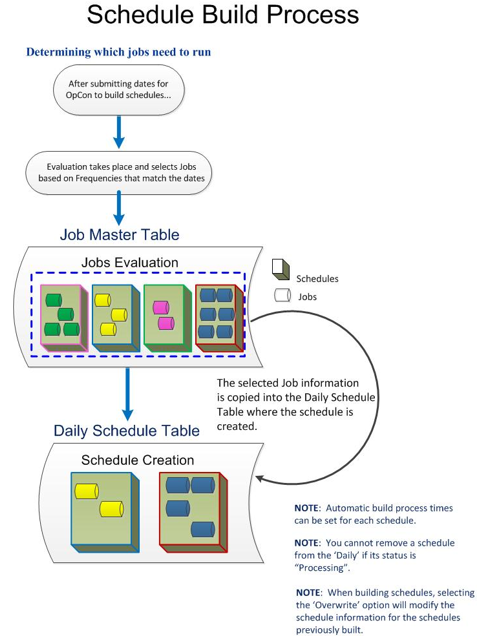

#  Building Daily Schedules

Building Daily schedules is the process of copying the Master schedules
and jobs that qualify for specified dates and putting them into the
active Daily processing tables for SAM. [SMA Technologies]{.GeneralCompanyName} recommends that customers build
schedules before the schedule start times to allow time for all
dependencies to resolve.

 

  ----------------------------------------------------------------------------------------------------------------------------- ---------------------------------------------------------------------------------------------------------------------------------------------------------------------------------------------------------------------------------------------------------------------------------
  .png "Note icon")   **NOTE:** [ If building a schedule for a date older than today or for a range of dates with the first date being older than today, OpCon automatically places the schedule [On Hold]{.skd-job-statuses} for all included defined dates.]
  ----------------------------------------------------------------------------------------------------------------------------- ---------------------------------------------------------------------------------------------------------------------------------------------------------------------------------------------------------------------------------------------------------------------------------

 

When defining the schedules to build, the user will have the option to:

-   Set a range of dates for building.
-   Determine if schedules will or will not be overwritten if found in
    the Daily tables.
    -   Existing schedules that are processing cannot be overwritten.
    -   If a schedule is set as *Multi-Instance*, the \"Overwrite
        Existing\" setting would never apply because each build would
        create a new instance.
-   Set specific property definitions for each schedule instance
    requested. If enabled, the following information can be supplied:

```{=html}
<!-- -->
```
-   If the schedule being processed has no defined instances, (refer to
    [Instance Definition](Instance-Definition.md)),
    the user can enter property definitions for an instance of a
    specific schedule in the format:

```{=html}
<!-- -->
```
-   In graphical interface, if the schedule being processed is
    configured to build an instance for each machine in a machine group
    (refer to [Instance Definition](Instance-Definition.md){.MCXref
    .xref}), the user can select a specific machine from the group.
-   In graphical interface, if the schedule being processed has one or
    more instance definitions with predefined user properties (refer to
    [Instance Definition](Instance-Definition.md)),
    the user can enter property definitions for an instance of a
    specific schedule in the format:
-   In graphical interface, if the schedule being processed is
    associated with one or more named instances (refer to [Instance     Definition](Instance-Definition.md)), the user can
    select a specific named instance then enter property definitions for
    the named instance in the format:

{.dropshadow}

 

All schedule build processing is managed by the SMASchedMan program on
the OpCon server. For additional information,
refer to
[SMASchedMan](../Server-Programs/SMA-Request-Router.md#SMASched){.MCXref
.xref} in the **Server Programs** online help.

 

Building Daily schedules can be managed using the following methods:

-   If automatic schedule maintenance is configured, the SAM will
    automatically build Daily schedules. For additional information,
    refer to [Schedule     Maintenance](Schedule-Definition.md#Schedule_Maintenance){.MCXref
    .xref}.
-   Schedule builds can also be automated using:
    -   OpCon events (refer to
        [Schedule-Related         Events](../OpCon-Events/Event-Types.md#Schedule){.MCXref
        .xref} in the **OpCon Events** online help)
    -   The DoBatch utility (refer to
        [DoBatch](../Utilities/Command-line-Utilities/DoBatch.md){.MCXref
        .xref} in the in the **Utilities** online help)
-   If an automatic Schedule Build process fails, the SAM will process
    the events on the SMA_SKD_BUILD job. For additional information,
    refer to [SMA_SKD Jobs on the AdHoc     Schedule](AdHoc-Schedule.md#SMA_SKD).
-   Schedule builds can be requested through the graphical interfaces.

+----------------------------------+----------------------------------+
| .p | concept.]            |
| ng "More Info icon") |                                  |
|                                  |                                  |
|                                  |                                  |
|                                  | For EM, visit the following      |
|                                  | sections in the **Enterprise     |
|                                  | Manager** online help:           |
|                                  |                                  |
|                                  | -   [Configuring Automatic       | |                                  |     Schedule                     |
|                                  |     Maint                        |
|                                  | enance](../UI/Enterprise-Manag |
|                                  | er/Configuring-Automatic-Sch |
|                                  | edule-Maintenance.md){.MCXref |
|                                  |     .xref}                       |
|                                  | -   [Building Daily              | |                                  |     Schedules](../UI/Ent         |
|                                  | erprise-Manager/Using-Schedu |
|                                  | le-Build.md#Building){.MCXref |
|                                  |     .xref}                       |
+----------------------------------+----------------------------------+
:::

 

