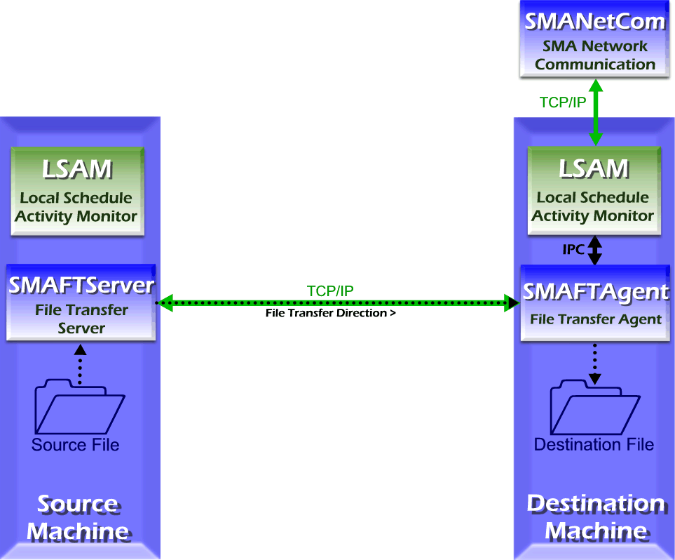

#  []{#top}File Transfer Jobs 
The SMA File Transfer (SMAFT) system reliably transfers files across
multiple platforms via an OpCon job. The
receiving and sending SMAFT Components (SMAFTAgent and SMAFTServer) are
installed with FT-enabled [LSAM]{.GeneralLSAM}s: Microsoft, IBM i, MCP, OS 2200 and BIS, UNIX, and z/OS. The source and destination machines
must have these components for a file transfer.

 

  ----------------------------------------------------------------------------------------------------------------------------- -----------------------------------------------------------------------------------
  .png "Note icon")   **NOTE:** [SMAFT for Windows needs a .NET version installed to work.]
  ----------------------------------------------------------------------------------------------------------------------------- -----------------------------------------------------------------------------------

File Transfer Job

{.dropshadow}

 

After receiving instructions from the resident [LSAM]{.GeneralLSAM}, the SMAFT Component on the machine determines the best method for
transporting the file with the SMAFT Component on the other machine.
After negotiating the file transfer settings between the SMAFT
Components, the file is transferred. Refer to the
[Configuration](#Configur) section for information on
controlling a transfer\'s behavior.

 

  ----------------------------------------------------------------------------------------------------------------------------- -------------------------------------------------------------------------------------------------------------------------------------------------------------------------------------------------------------------------------------
  .png "Note icon")   **NOTE:** [No matter which machine the job starts on, the file transfer port for that machine must be open on the firewall. For more information, refer to [File Transfer Settings](Machines.md#File).]
  ----------------------------------------------------------------------------------------------------------------------------- -------------------------------------------------------------------------------------------------------------------------------------------------------------------------------------------------------------------------------------

## Configuration

Before attempting a transfer, configure the machines in the EM plus the
source and destination machines\' LSAMs.

 

In the source and destination machines\' [LSAM]{.GeneralLSAM} configuration files, define the parameters for file transfers. Normally,
these settings are commingled with the [LSAM]{.GeneralLSAM}\'s Job Output Retrieval System (JORS) parameters.

-   For IBM i LSAM file transfer configuration information, refer to
    [The SMA File Transfer     Process](https://help.smatechnologies.com/opcon/agents/ibmi/latest/Files/Agents/IBM-i/SMA-File-Transfer.md#The){.MCXref
    .xref} in the in the **IBM i LSAM** online help.
-   For MCP LSAM file transfer parameters, refer to the settings in the
    section for the [Optional Modules     (OPT)](https://help.smatechnologies.com/opcon/agents/mcp/latest/Files/Agents/MCP/Optional-Modules-(OPT).md#MCP_LSAM_Configuration_Settings:_Optional_Modules:_File_Transfer){.MCXref
    .xref} table in the **MCP LSAM** online help.
-   For Microsoft LSAM file transfer parameters, refer to [JORS     Settings](https://help.smatechnologies.com/opcon/agents/windows/latest/Files/Agents/Microsoft/JORS-Settings.md){.MCXref
    .xref} in the **Microsoft LSAM** online help.
-   For UNIX LSAM file transfer parameters, refer to [JORS and SMAFT     Parameters](https://help.smatechnologies.com/opcon/agents/unix/latest/Files/Agents/UNIX/JORS-and-SMAFT-Parameters.md){.MCXref
    .xref} in the **UNIX LSAM** online help.
-   For OS 2200 and BIS file transfer configuration information, refer
    to [JORS and File Transfer     Configuration](https://help.smatechnologies.com/opcon/agents/os2200/latest/Files/Agents/OS-2200/Configuration.md#JORS_and_File_Transfer_Configuration){.MCXref
    .xref} in the **OS 2200 LSAM** online help.
-   For z/OS LSAM file transfer configuration information, refer to
    [Standalone File     Transfer](https://help.smatechnologies.com/opcon/agents/zos/latest/Files/Agents/zOS/Standalone-File-Transfer.md){.MCXref
    .xref} in the **z/OS LSAM** online help.

In the EM, adjust the Settings for the destination machine to correspond
with the source machine\'s LSAM file transfer settings (or vice versa).
Under the category File Transfer Settings, define the \"File Transfer\"
type and the \"File Transfer Port Number\". Once configuration is
complete (and verified), a File Transfer Job can be defined. For
additional information on File Transfer, refer to [File Transfer Job Details](File-Transfer-Job-Details.md).

## Logging

Each LSAM logs file transfer information differently.

-   For the IBM i [LSAM]{.GeneralLSAM}, the SMAFT Agent writes all     processing information to the SMAFT Agent logging system, and the
    SMAFT Server writes all processing information to the SMAFT Server
    logging system. Logging behavior is defined in the SMA File Transfer
    Menu. For information on these settings, refer to [SMA File Transfer     Menu](https://help.smatechnologies.com/opcon/agents/ibmi/latest/Files/Agents/IBM-i/SMA-File-Transfer.md#SMA6){.MCXref
    .xref} in the **IBM i LSAM** online help.
-   For the MCP LSAM, the SMAFTAgent logs general information messages
    to the PRT_FTAGENT print file when SW2 is set for the LSAM. For
    information on setting debug switches, refer to [Problem Resolution     and
    Debugging](https://help.smatechnologies.com/opcon/agents/mcp/latest/Files/Agents/MCP/Problem-Resolution-and-Debugging.md){.MCXref
    .xref} in the **MCP LSAM** online help.
-   For the Microsoft LSAM, the SMAFTAgent writes all processing
    information to the SMAFTAgent.log file in the \<Output
    Directory\>\\MSLSAM\\Log\\ directory. Logging behavior is defined in
    the LSAM\'s Debug Settings. For information on these settings, refer
    to [Debug     Options](https://help.smatechnologies.com/opcon/agents/windows/latest/Files/Agents/Microsoft/Debug-Options.md){.MCXref
    .xref} in the **Microsoft LSAM** online help.

  ----------------------------------------------------------------------------------------------------------------------------- ------------------------------------------------------------------------------------------------------------------------------------------------------------------------
  .png "Note icon")   **NOTE:** [The Output Directory was configured during installation. For more information, refer to [File Locations](File-Locations.md).]
  ----------------------------------------------------------------------------------------------------------------------------- ------------------------------------------------------------------------------------------------------------------------------------------------------------------------

-   For the UNIX LSAM, the SMAFTAgent logs general information messages
    to the UNIX LSAM logfile and logs error messages to the UNIX LSAM
    errfile. The UNIX LSAM itself controls the maintenance of logs. For
    information on these logs, refer to [JORS and SMAFT     Parameters](https://help.smatechnologies.com/opcon/agents/unix/latest/Files/Agents/UNIX/JORS-and-SMAFT-Parameters.md){.MCXref
    .xref} in the **UNIX LSAM** online help.
-   For the OS 2200 LSAM, the SMAFT Agent writes all processing
    information to the SMAFT log file, and the SMAFT Server (JORS)
    writes all processing information to the SMAJOR log file. Logging
    behavior is defined in the under the Debug Mode in the Advanced
    Options of the LSAM\'s configuration. For information on these
    settings, refer to [Configuration Settings -- Advanced     Options](https://help.smatechnologies.com/opcon/agents/os2200/latest/Files/Agents/OS-2200/Configuration.md#Advanced_Options)
    in the **OS 2200 LSAM** online help.
-   For the z/OS LSAM, file transfer is run as a job; therefore, the log
    for the job contains the logging information.
:::

 

