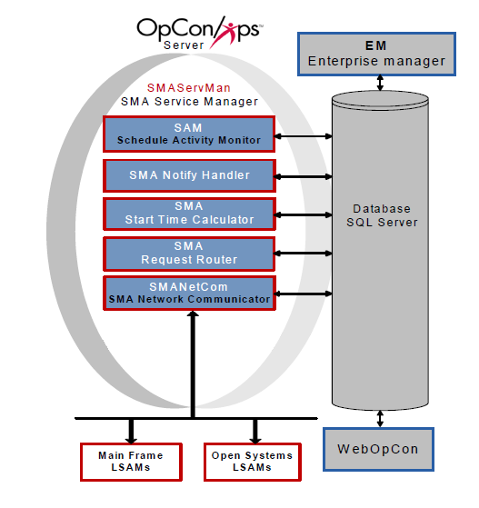

#  []{#top}Getting Started with OpCon 
OpCon (Operations Console Cross-Platform
Scheduler) is an enterprise-wide, heterogeneous workflow automation
system. The OpCon Server components include
the [database](Database.md) and [Schedule Activity Monitor (SAM) and
supporting services](SAM-and-Supporting-Services.md). On user
desktops, fat client and web-based interfaces connect to the database to
manage the data for automation. The agents responsible for executing
jobs are called Local Schedule Activity Monitors (LSAMs).

OpCon Architecture Overview

{.dropshadow}
:::

 

