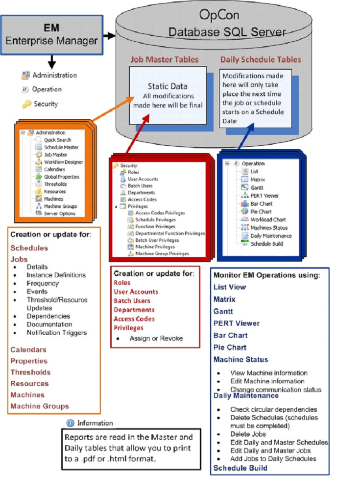

#  Graphical User Interfaces

OpCon provides two primary graphical user
interfaces. One interface is a rich client interface for installation on
Windows and Linux operating systems called the Enterprise Manager (EM).
The other interface is a browser-based interface called the Solution
Manager. These interfaces are the primary means of controlling the data
used by OpCon. These applications access the
OpCon database to manage the data for
automation. These interfaces also manage operations once the automation
is configured. For additional information on the Enterprise Manager,
refer to the **Enterprise Manager** online help. For additional
information on the Solution Manager, refer to the **Solution Manager**
online help.

Graphical User Interfaces

{.dropshadow}
:::

 

