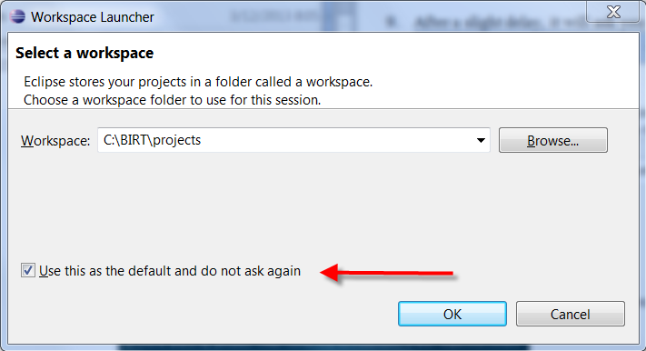
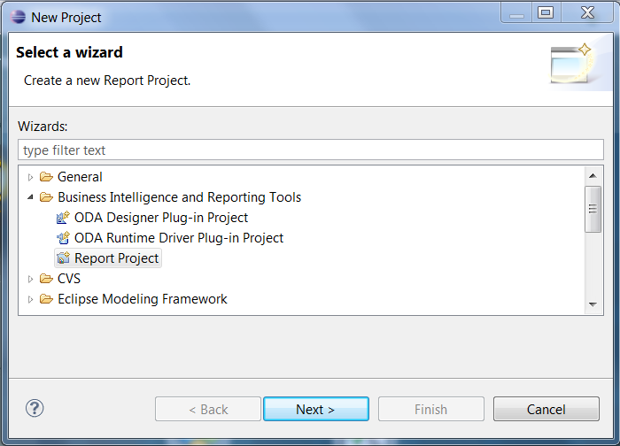
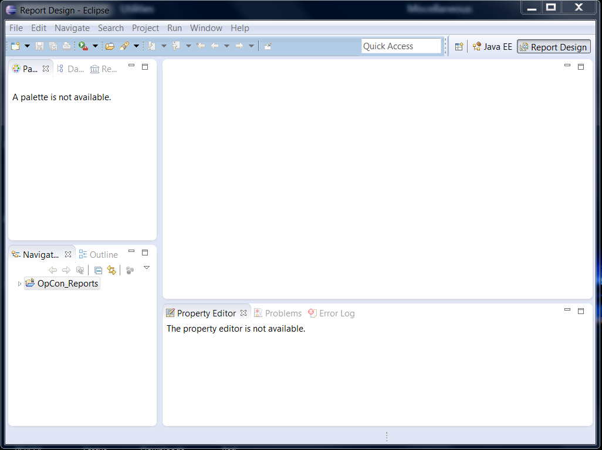
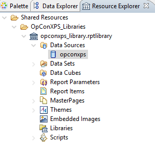
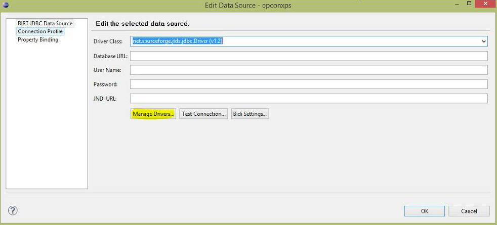
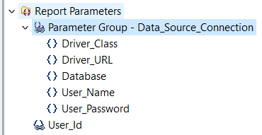

# Custom Reports

## Introduction

[]{#aanchor21} This topic is intended to serve as a guide on how to create an environment that allows users to edit the BIRT reports
supplied by [SMA Technologies]{.GeneralCompanyName} or create their own. 
## Install the Environment

1.  Create a *BIRT directory* to hold the environment. This should be a
    complete, standalone directory structure containing everything
    needed for report modification.

2.  Create a *projects directory* under the *BIRT directory*.

3.  Locate the **jtds-1.2.5.jar** file and copy it to the *BIRT
    directory*.

4.  Download **BIRT** for the correct environment from
    <http://archive.eclipse.org/birt/downloads/build.php?build=R-R1-3_7_1-201109131734>.

5.  Move the *downloaded file* to the *BIRT directory*.

6.  Extract the *zip file* to the *BIRT directory*. The directory
    structure should look similar to the following:

7.  Navigate to the **eclipse** sub-directory and double-click the
    **eclipse.exe** file to run the program.

8.  Browse to the *projects directory* created earlier.

9.  Select the **Use this as the default and do not ask again**
    checkbox.

    Select a Workspace

    {.dropshadow}

10. Launch after setting the workspace.

11. Use menu path **File\> New \> Project** to create the
    **OpCon_Reports** project. A wizard will display allowing you to
    select the project type.

12. Expand the **Business Intelligence and Reporting Tools** folder.

13. Select **Report Project**.

    Select a Wizard

    {.dropshadow}

14. Click **Next**.

15. Enter **OpCon_Reports** in the **Project name** field. Leave **Use
    default location** selected.

16. Click **Finish**.

17. Select **Remember my decision** when asked if you want to open the
    **Report Designer perspective**.

18. Click **Yes**.

19. Click on the **x** to the right of the **Welcome** tab to close the
    Welcome screen (if displayed).

20. The resulting screen should look similar to the following:

    Report Design

    {.dropshadow}

## Install the SMA Reports

1.  Use menu path: **File \> Import\...**. The **Import** wizard will
    start.
2.  Expand the **General** folder.
3.  Select **File System**.
4.  Click **Next**.
5.  Browse to the *reports sub-directory* under the Enterprise Manager
    directory.
6.  Select the **reports** folder to include all of the sub-directories.
7.  Click **OK**.
8.  Select the **reports** folder checkbox.
9.  Enter **OpCon_Reports** in the **Into folder** field (if empty).
10. Click **Finish**.

Now you can edit SMA Reports or create your own.

## Create a New Report

1.  Right-click on **OpConXPS_Reports**.

2.  Use menu path: **New \> Report**.

3.  Enter a *file name*.

4.  Click **Finish**.

5.  Navigate to the **OpConXPS_Libraries** folder.

6.  Use path: **opconxps_library.rptlibrary \> data sources \>
    opconxps**.

    Resource Explorer

    {.dropshadow}

7.  Right-click on **opconxps** and add it to the report.

8.  Navigate to the **Data Explorer** tab.

9.  Double-click on **opconxps** under **Data Sources**.

10. Enter **net.sourceforge.jtds.jdbs.Driver(v1.2)** in the **Driver
    Class** field to connect to BIRT.

    Edit Data Source

    {.dropshadow}

11. Click **Manage Drivers**.

12. Click the **Add\...** button.

13. Navigate to the *BIRT directory* to add the **jtds-1.2.5.jar** file.

14. Click **OK**.

## Import the Database Connection Parameters

You need to be connected to the database to receive the data. Use the
following steps to import the following two parameters:

-   **Parameter Group -- Data_Source_Connection**: This parameter is a
    database connection.
-   **User_Id**: To add the privileges access to the report, you can
    grant access with this parameter and filter it in the query.

1.  Use path: **Shared Resources \> OpConXPS_Libraries \>
    opconxps_library.rptlibrary \> Report Parameters**.
2.  Expand the **Report Parameters** folder.
3.  Right-click on **Parameter Group - Data_Source_Connection** and
    select **Add to report**.
4.  Right-click on **User-Id** and select **Add to report**.

In the workplace section, you should see the following:

Report Parameters

{.dropshadow}

 

You can modify the parameters to connect the report to your own
database.

**Driver_Class**: The default value should always be the following:
net.sourceforge.jtds.jdbc.Driver.

**Driver_URL**: Enter the URL for the database using the format the
driver requires.

+----------------------------------+----------------------------------+
|  |                                  |
| .png "Example icon") |                                  |
|                                  |                                  |
|                                  | jdbc:mysql:                      |
|                                  | //\<host\>:\<port\>/\<database\> |
+----------------------------------+----------------------------------+

-   Enter the database path for you environment in the database URL.
    From the former example, \"jdbc:jtds:sqlserver://\" is the
    connection with the database. Change the server name and the port
    number to match your environment, e.g., jdbc:jtds:sqlserver://server
    name/database name.
-   For more information, refer to the [accessing data using a textual     query or stored
    procedure](http://otadocs.opentext.com/documentation/ihub3/help/BIRTDesigner/index.mdl#page/DAG/con-HowToSpecifyConnectionInformationForDatabaseOrOtherJDBCDataSource.mdl).
-   If you have a SQL instance, please add \";instance=\< instance
    name\>\" at the end of the database URL.

**Database**: This parameter defines the database name, which is
\"opconxps\" by default.

**User_Name** and **User_Password**: Enter the login for the database
for these parameters.

After editing the report, copy the report from the OpConXPS_Reports
folder, e.g., C:\\BIRT\\projects\\OpCon_Reports\\OpConXPS_Reports, to
the reports sub-directory under the Enterprise Manager directory, e.g.,
C:\\Program Files\\OpConxps\\EnterpriseManager
x64\\reports\\OpConXPS_Reports.

## Schedule the New Reports

1.  Add the *report(s)* to the path: **\<OpCon Install
    Folder\>\\SAM\\BIRT\\ReportEngine\\OpConXPS_Reports**.
2.  Create or use an existing **Schedule** in the Enterprise Manager.
3.  Create a **Windows** job with the *report name* as the *job name*.
4.  Select the Windows **Primary Machine**.
5.  Select **Run Program** in the **Job Action** drop-down menu.
6.  Select **Use Service Account** in the **User Id** drop-down menu.
7.  Enter **\[\[SMAOpConPath\]\]\\Utilities\\BIRTRptGen.exe** followed     by the *report name* as **-rReportName** in the **Command Line**
    field.
8.  *(Optional)* Add parameters after the report name
    using the following format: **-pParameterName=ParameterValue**.
9.  Enter **\[\[SMAOpConPath\]\]\\Utilities\\** in the **Working     Directory** field.
10. Enter a *frequency*.
11. Build the **job**.
:::

 

