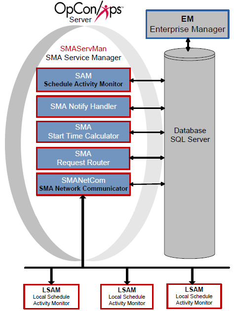

#  Introduction

The SAM and supporting services (SAM-SS) are the central components of
OpCon.

OpCon SAM and Supporting Services

{.dropshadow}

The components include:

  Component Name                                                                                                Description
  ------------------------------------------------------------------------------------------------------------- ---------------------------------------------------------------------------------------------------------------------------------------
  [SMA Service Manager (SMAServMan)](SMA-Service-Manager.md)                                A service responsible for the startup, shutdown, and failover of the SAM-SS.
  [Schedule Activity Monitor (SAM)](Schedule-Activity-Monitor.md)                           A background process communicating with the database to manage job submissions and process OpCon events.
  [SMA Network Communications Module (SMANetCom)](SMA-Network-Communications-Module.md)   A background process communicating with the database and with all LSAMs to send and receive job information and other communications.
  [SMA Notify Handler](SMA-Notify-Handler.md)                                               A background process communicating with the database to send notifications from OpCon/xps Events or from the ENS Manager.
  [SMA Request Router](SMA-Request-Router.md)                                               A background process responsible for routing requests between the OpCon database and the various Request Handlers.
  [SMA Start Time Calculator](SMA-Start-Time-Calculator.md)                               A background process responsible for periodically recalculating start times for jobs in the OpCon Daily tables.
  [Optional Components](Optional-Components.md)                                               Additional optional components installed with the SAM that may be configured at any time.
:::

 

