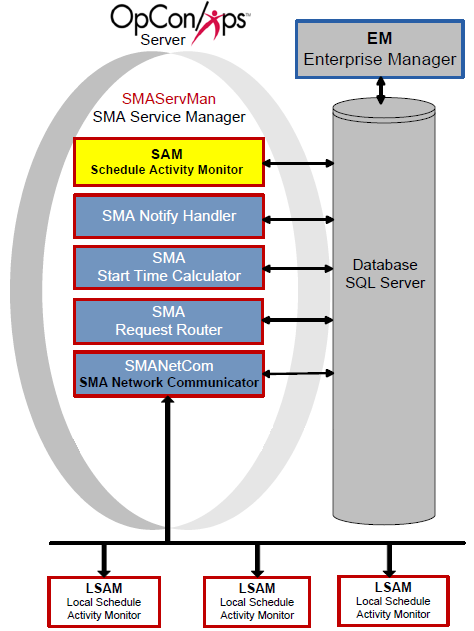

# Schedule Activity Monitor (SAM)

The Schedule Activity Monitor (SAM) component determines when jobs in
the Daily tables qualify for submission to an LSAM and also processes
OpCon events. The SAM places messages for the LSAMs in the database and
monitors the database for responses. When the responses are received,
the SAM updates job statuses and re-qualifies jobs for processing. The
SAM also processes events in the database and events received from
external sources. For information on events, refer to the [OpCon Events](../OpCon-Events/Introduction.md) online help.

Schedule Activity Monitor

{.dropshadow}

## Job Qualification Process

The SAM analyzes information from the database to determine when to
submit jobs.

### Factors of Analysis

The SAM\'s analysis includes:

-   Start time
-   Job dependencies and current job statuses
-   Threshold/resource dependencies and current threshold/resource
    values
-   Machine availability

### Order of Analysis

The SAM checks a job for processing in the following order:

1.  Job Qualifications for Start
2.  Latest Allowable Start Time
3.  Start Time
4.  Job Dependencies
5.  Threshold/Resources
6.  Expression Dependencies
7.  Machine Availability

## SAM Processing Options

The processing options for the Schedule Activity Monitor (SAM) are
configured through the Enterprise Manager (EM). For information on
configuring SAM processing options, refer to [OpCon Server Options](../Concepts/OpCon-Server-Options.md) in the
**Concepts** online help.

## SMA Connection Configuration Tool

The SMA Connection Configuration program contains connection information
to the SQL Server database. Changing the SQL connection configuration is
possible only from the SAM application server. Additionally, the SAM-SS
must be stopped and restarted to detect new SQL connection configuration
information.

### Menus

The menus available are **File** and **Help**.

#### File

The **File** menu has the following option:

-   **Exit**: Closes SMA Connection Configuration.

#### Help

The **Help** menu has the following option:

-   [About]{._Override style="font-weight: bold;"}: Displays product     versions and Technical Support information.

### Connection Details

The Connection Details contain the configuration parameters related to
the SQL connection.

-   [[]{#Server\\Instance_Name}Server\\Instance Name]{._Override     style="font-weight: bold;"}: Defines the SQL Server (with instance
    name if needed).
-   [Database Name]{._Override style="font-weight: bold;"}: Defines the     name of the OpCon database.
-   [Database Login ID]{._Override style="font-weight: bold;"}:     Represents a valid Database Login ID allowing the SAM-SS to access
    the database through the .NET SQL Client.
-   [Database Password]{._Override style="font-weight: bold;"}: Defines     the valid SQL Server password for the Database Login ID.
-   [Use Windows Authentication]{._Override style="font-weight: bold;"}:     This checkbox indicates if the SAM and Supporting Services, and any
    other application that uses the SMAODBCConfiguration.dat file should
    log in with Windows Authentication to SQL Server.
-   **Configuration**: Configures how to create the database connection.
    Options are:
    -   **None**: Specifies no setting. This is the default.
    -   **SQL Always On**: Specifies that SQL Server has been configured
        to use SQL high availability.
    -   **SQL Mirroring**: Specifies that SQL Server has been configured
        to use mirroring.

### Buttons

-   [OK]{._Override style="font-weight: bold;"}: Equivalent to clicking     the Connect button and then closing the application.
-   [Connect]{._Override style="font-weight: bold;"}: Verifies     connection to the database and updates the configuration file.
-   [Refresh]{._Override style="font-weight: bold;"}: Undoes the changes     make to the fields on the dialog by reloading values from the
    configuration file.
-   [Cancel]{._Override style="font-weight: bold;"}: Exits the program     without making changes to the configuration file.

[[]{#Request_a_New_License_File_from_SMA}Request a New License File from SMA Technologies]{.ul}

After maintenance has been paid to [SMA Technologies]{.GeneralCompanyName} and it is time to request a new
license file, complete the following procedure.

Log in to the **Enterprise Manager**.

Use menu path: **Help \> About OpCon/xps Enterprise Manager**.

Click the **License Information** tab.

  ----------------------------------------------------------------------------------------------------------------------------- ------------------------------------------------------------------------------------------------------
  .png "Note icon")   **NOTE:** [Only users with granted privileges can view the **License Information** tab.]
  ----------------------------------------------------------------------------------------------------------------------------- ------------------------------------------------------------------------------------------------------

At the end of the first line, select the System ID (e.g.,
SMAServer_1234).

Right-click and select **Copy**.

Send an email to <license@smatechnologies.com> with the subject line
\"License File Request\". Include the following information in the
message:

a.  Environment for the SAM and database (e.g., Production)
b.  The System ID copied from the Help tab (press Ctrl + V to paste the
    value from the clipboard)
c.  Your company\'s name

[Place the License File in the SAM Directory]{.ul} 
After [SMA Technologies]{.GeneralCompanyName} responds to the license request, save the license file to the SAM directory.

 

  ---------------------------------------------------------------------------------------------------------------------------------- -------------------------------------------------------------------------------------------------------------------------------------------------------------------------------------------------------------------------------------------------------------------------
  .png "Caution icon")   **CAUTION:** [If the license file is encrypted after being received from [SMA Technologies]{.GeneralCompanyName} (e.g., saved to a Windows folder set with the \"Encrypt contents to secure data\" option), SAM will not be able to read the license file.]
  ---------------------------------------------------------------------------------------------------------------------------------- -------------------------------------------------------------------------------------------------------------------------------------------------------------------------------------------------------------------------------------------------------------------------

1.  Open your email program to get the license file from [SMA     Technologies]{.GeneralCompanyName}.
2.  Open the **email message** containing the license file.
3.  Right-click the **license file** and select **Save As**.
4.  Browse to the SAM Installation directory.
5.  Click the **Save** button.
:::

 

