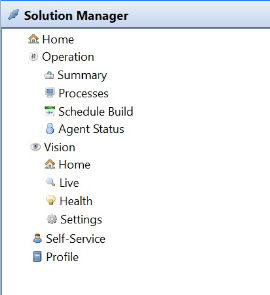

[]{#top} 
#  Working with Solution Manager

The **Solution Manager** topic in the [Navigation Panel]{.GeneralNavigation} provides links to access Solution Manager
modules and pages from within the Enterprise Manager.

 

  -------------------------------------------------------------------------------------------------------------------------------- --------------------------------------------------------------------------------------------------------------------------------------------------------------------------------------------------------------------------------------------------------------------------------------------------------------------------------------------
  .png "Note icon")   **NOTE:** [The Solution Manager topic will only appear in the [Navigation Panel]{.GeneralNavigation} if the **Solution Manager URL** General Server Option is defined. For more information, refer to [Solution Manager URL](../../Concepts/General.md#Solution_Manager_URL) in the **Concepts** online help.]
  -------------------------------------------------------------------------------------------------------------------------------- --------------------------------------------------------------------------------------------------------------------------------------------------------------------------------------------------------------------------------------------------------------------------------------------------------------------------------------------

 

  -------------------------------------------------------------------------------------------------------------------------------- --------------------------------------------------------------------------------------------------------------------------------------------------------------------------------------------------------------------------------------------------------------------------------------------------------------------------------------------------------------------------------------------------------
  .png "Note icon")   **NOTE:** [For you to view licensed modules or features, you must have all of the appropriate privileges. For additional information, refer to [Working with Self Service](../Solution-Manager/Working-with-Self-Service.md) and [Working with Vision](../Solution-Manager/Working-with-Vision.md) in the **Solution Manager** online help.]
  -------------------------------------------------------------------------------------------------------------------------------- --------------------------------------------------------------------------------------------------------------------------------------------------------------------------------------------------------------------------------------------------------------------------------------------------------------------------------------------------------------------------------------------------------

 

Click on any **Solution Manager** [function item[[]{.MCTextPopupArrow}Fuction items are displayed as icons with
descriptions in the Navigation Panel.]{.MCTextPopupBody
.MCTextPopupBody_Closed .needs-pie .popupBody
aria-hidden="true"}](javascript:void(0)){.MCTextPopup .popup .popupHead}
in the graphic to learn more about that item.

 

{.flat}
:::

 

