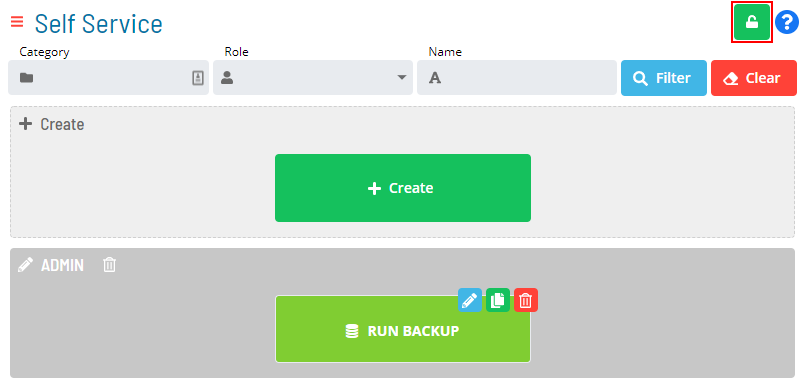

#  Enabling Admin Mode Editing

To enable creating new Service Requests or editing existing Service
Requests, click the **Admin Mode** button at the top-right corner:

Admin Mode Editing Toggle Switch

{.dropshadow}

 

The **Lock** button will switch to unlocked, and the Self Service page
will display with editing privileges, as shown in the example graphic.
Learn more about those privileges by visiting the [Working in Admin Mode](Working-in-Admin-Mode.md) section of this help.

Admin Mode Editing Enabled

{.dropshadow}

 

The **Admin Mode** button will not be visible to users who are not in
the «ocadm» role or a role with the «Maintain Service Request»
privilege.

 

  -------------------------------------------------------------------------------------------------------------------------------- --------------------------------------------------------------------------------------------------------------------------------------------------------------------------------------------------------------------------------------------------
  .png "Note icon")   **NOTE:** [For more information about Function Privileges including those pertaining to the Maintaining Service Requests, refer to [Function Privileges](../../Concepts/Function-Privileges.md) in the **Concepts** online help.]
  -------------------------------------------------------------------------------------------------------------------------------- --------------------------------------------------------------------------------------------------------------------------------------------------------------------------------------------------------------------------------------------------
:::

 

