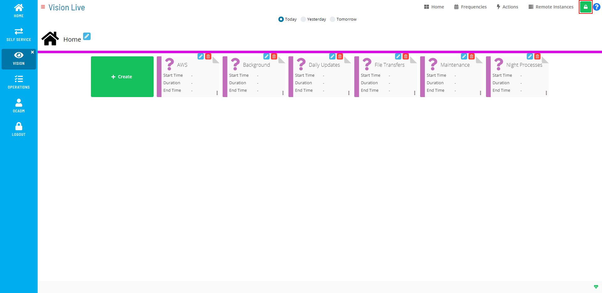

#  Enabling Admin Mode Editing

To enable creating or editing Vision cards, frequencies, actions, or
remote instances, click the **Admin Mode** button at the top-right
corner:

Admin Mode Editing Toggle Switch

{.dropshadow}

 

The **Lock** button will switch to unlocked, and the Vision Live page
will display with editing privileges, as shown in the example graphic.

Admin Mode Editing Enabled

{.dropshadow}

 

The **Admin Mode** button will not be visible to users who are not in
the «ocadm» role or a role with the «Maintain Vision Workspaces»
privilege.

 

  -------------------------------------------------------------------------------------------------------------------------------- ------------------------------------------------------------------------------------------------------------------------------------------------------------------------------------------------------------------------
  .png "Note icon")   **NOTE:** [For more information about Function Privileges including those pertaining to Vision, refer to [Function Privileges](../../Concepts/Function-Privileges.md) in the **Concepts** online help.]
  -------------------------------------------------------------------------------------------------------------------------------- ------------------------------------------------------------------------------------------------------------------------------------------------------------------------------------------------------------------------
:::

 

