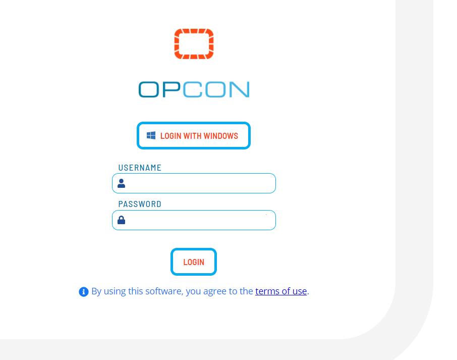
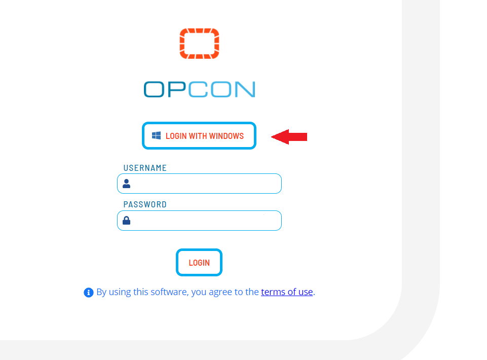
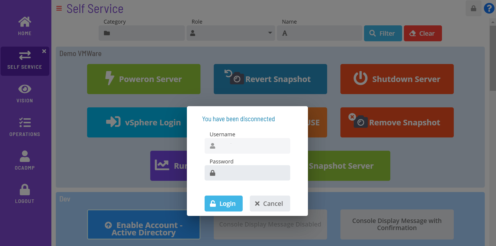

#  Logging In/Out

## Logging In

Log into the SMA Solution Manager with an
OpCon username and password.

  -------------------------------------------------------------------------------------------------------------------------------- --------------------------------------------------------------------------------------------------------------
  .png "Note icon")   **NOTE:** [Keep in mind that the OpCon password field permits up to a maximum of 12 characters.]
  -------------------------------------------------------------------------------------------------------------------------------- --------------------------------------------------------------------------------------------------------------

  -------------------------------------------------------------------------------------------------------------------------------- --------------------------------------------------------------------------------------------------------------------------------------------------------------------------------------------------------------------
  .png "Note icon")   **NOTE:** [If data migration is required, your login may be rejected. A member of the ocadm role must perform [data migration](Migrating-Data.md) before you can gain access into the application.]
  -------------------------------------------------------------------------------------------------------------------------------- --------------------------------------------------------------------------------------------------------------------------------------------------------------------------------------------------------------------

Solution Manager Login Screen

{.dropshadow}

+----------------------------------+----------------------------------+
| .png "Note icon") | or attempt to access the         |
|                                  | application via automatic login. |
|                                  | Those users must Accept or       |
|                                  | Decline this message. If         |
|                                  | accepted, then the user may      |
|                                  | proceed as normal to access the  |
|                                  | features and data in the         |
|                                  | application. If declined, then   |
|                                  | the user will either be returned |
|                                  | to the login screen or presented |
|                                  | with the security                |
|                                  | message.]            |
|                                  |                                  |
|                                  |                                  |
|                                  |                                  |
|                                  | The Security message is          |
|                                  | configured under the             |
|                                  | **Generals** tab of the **Server |
|                                  | Options** editor in the          |
|                                  | Enterprise Manager. For more     |
|                                  | information about security       |
|                                  | message configuration, refer to  |
|                                  | the [Login Security              | |                                  | Mes                              |
|                                  | sage](../../Concepts/General.md |
|                                  | #Login_Security_Message){.MCXref |
|                                  | .xref} parameter in the          |
|                                  | **Concepts** online help.        |
+----------------------------------+----------------------------------+

### Automatic Login

Solution Manager supports automatic login when Windows Authentication is
turned on.

First, make sure you have configured users in
OpCon for Automatic Login using the
Enterprise Manager.

  -------------------------------------------------------------------------------------------------------------------------------- --------------------------------------------------------------------------------------------------------------
  .png "Note icon")   **NOTE:** [The user in the Enterprise Manager needs to include the Windows Domain and Username.]
  -------------------------------------------------------------------------------------------------------------------------------- --------------------------------------------------------------------------------------------------------------

Google Chrome uses the security settings in **Internet Options**. The
Custom setting **Prompt for user name and password** should not be
selected.

To configure this setting:

1.  Right-click **Start** and select **Control Panel** from the
    **Windows** menu.
2.  Navigate to **Internet Options**.
3.  Navigate to the **Security** tab and select the **Local intranet**
    zone.
4.  Click the **Custom level**... button. The **Security Settings**
    dialog displays.
5.  Navigate to **User Authentication \> Logon** and verify that the
    **Prompt for user name and password** radio button is not selected.

Firefox requires configuration.  [SMA Technologies]{.GeneralCompanyName} recommends having only one Firefox window open during configuration.

To configure this setting:

1.  Enter **about:config** in the search field and press **Enter** on
    your keyboard.
2.  Click **Show All**.
3.  Enter **network.automatic-ntlm-auth.trusted-uris** in the **Search
    preference name** search field.
4.  Click the **Edit** button then enter the Solution Manager URL (e.g.,
    https://\<servername\>:\<portnumber\>) in the text field.
5.  Click **Save**.
6.  Enter **network.negotiate-auth.delegation-uris** in the **Search
    preference name** search field.
7.  Click the **Edit** button then enter the Solution Manager URL (e.g.,
    https://\<servername\>:\<portnumber\>) in the text field.
8.  Click **Save**.
9.  Enter **network.negotiate-auth.trusted-uris** in the **Search
    preference name** search field.
10. Click the **Edit** button then enter the Solution Manager URL (e.g.,
    https://\<servername\>:\<portnumber\>) in the text field.
11. Click **Save**.

  -------------------------------------------------------------------------------------------------------------------------------- --------------------------------------------------------------------------------------------------------------------------------------
  .png "Note icon")   **NOTE:** [For more information, refer to <https://developer.mozilla.org/en-US/docs/Mozilla/Integrated_authentication>.]
  -------------------------------------------------------------------------------------------------------------------------------- --------------------------------------------------------------------------------------------------------------------------------------

If the automatic logon fails, then the login screen will display so that
you can provide the OpCon account
credentials.

### Windows Authentication Login

The **Login with Windows** button is available to allow you to log into
the application using Windows Authentication and bypass entering OpCon
login credentials. When activated, your Windows credentials are sent to
the server for authentication.

Login Screen: Login with Windows Button

{.dropshadow}

 

In order for the button to display on the login screen, you will need to
ensure that a few settings are configured.

-   **Enable Windows Authentication** option should be enabled in the
    **Server Options** editor in the Enterprise Manager. Alternatively,
    Windows Authentication can be enabled by the API.
-   **Windows Pass-Through Authentication** should be enabled in the
    [Application Settings](Configuring-Application-Settings.md) in
    the Solution Manager.

### Session Expiration

Should the browser session expire, a pop-up window will display to allow
you to log back into the application without having to go to the login
screen. Depending on how you initially logged in, the pop-up will either
prompt for your login credentials or display the **Login with Windows**
button.

Session Expiration: Login Pop-up Window

{.dropshadow}

## Logging Out

Select **Logout** button in the **Navigation** menu on the
**[Home](SM-UI-Layout.md)** page to disconnect from the current
database.
:::

 

