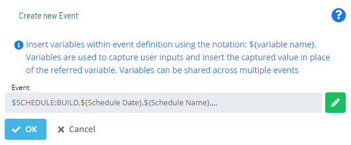

# Setting up OpCon Events

To add an OpCon event to the Service Request:

Click the green **Add** button below the **Events** label on the **New
Service Request** page.

{.dropshadow}

The **Create New Event** window will display, as shown in the example
graphic.

{.dropshadow}

Select an OpCon **Event Template** to start
defining event details. Once you choose a template, the screen
dynamically changes to provide UI assistance for filling out the event
details.

  -------------------------------------------------------------------------------------------------------------------------------- --------------------------------------------------------------------------------------------------------------------------------------------------------------------------------------------------------------------------------------------------------------------------------------------------------------
  .png "Note icon")   **NOTE:** [The **Event Template** drop-down contains several Administrative Events for advanced operations. For more information on these type of events, refer to [Administrative Events](../../OpCon-Events/Event-Types.md#Administ) in the **OpCon Events** online help.]
  -------------------------------------------------------------------------------------------------------------------------------- --------------------------------------------------------------------------------------------------------------------------------------------------------------------------------------------------------------------------------------------------------------------------------------------------------------

Insert *variable(s)* into any part of the Event using the following
notation: **\${variable}**

-   You can use the same variable multiple times in the same Event, as
    well as in other Events for the same Service Request. If you do
    this, the variable will appear as only one User Input. This means
    that the one value the user supplies will be used for every instance
    of that variable.

-   []{#aanchor419} You have the option to use the following system     variables specifically in Solution Manager:

    -   **\${SM.USER.LOGIN}** - Resolves to the Name defined for the
        OpCon user who clicked the Service
        Request button.
    -   **\${SM.USER.NAME}** - Resolves to the Full User Name defined
        for the OpCon user who clicked the
        Service Request button.
    -   **\${SM.USER.EMAIL}** - Resolves to the Email Address defined
        for the OpCon user who clicked the
        Service Request button.
    -   **\${SM.USER.COMMENTS}** - Resolves to the Comments defined for
        the OpCon user who clicked the
        Service Request button.

 

The variable(s) will be resolved before the Event is sent to
OpCon.

 

-   A preview of the defined Event displays below the **Event Template**
    drop-down list, as shown in the example graphic.

Complete the *Event definition*.

*(Optional)* Click the []{#Manual_Edit}**Manual Edit** button to define an Event manually. **Manual Edit** can also be used to
edit an Event that was defined using the **Event Template** option, as
shown in the example graphic.

{.dropshadow}

Click the **OK** button to apply your changes and return to the
**Service Request definition** page. You can also select the **Cancel**
button to discard the Event changes.
:::

 

