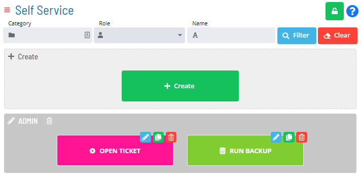

#  Setting up Privileges

The last step is to attribute which OpCon
role(s) will be able to see the Service Request buttons and run them
from the Service Request page.

-   Users in the «ocadm» role have access to all Service Requests,
    therefore «ocadm» will not appear in the Granted list.
-   Non-ocadm users must grant at least one role access to the Service
    Request.
-   You can only view and grant access to your roles.
-   If a role that does not belong to you is assigned to one of your
    Service Requests, the name of the role is displayed as "Unauthorized
    Role."

 

Click the **Save** button to save the changes to the database and return
to the main page of Self Service. The Self Service page now displays the
newly-created Service Request button.

 

{.dropshadow}

 

  -------------------------------------------------------------------------------------------------------------------------------- ---------------------------------------------------------------------------------------------------------------------------------------------------------------------
  .png "Note icon")   **NOTE:** [For more information about roles and granting roles privileges, refer to [Roles](../../Concepts/Roles.md) in the **Concepts** online help.]
  -------------------------------------------------------------------------------------------------------------------------------- ---------------------------------------------------------------------------------------------------------------------------------------------------------------------
:::

 

