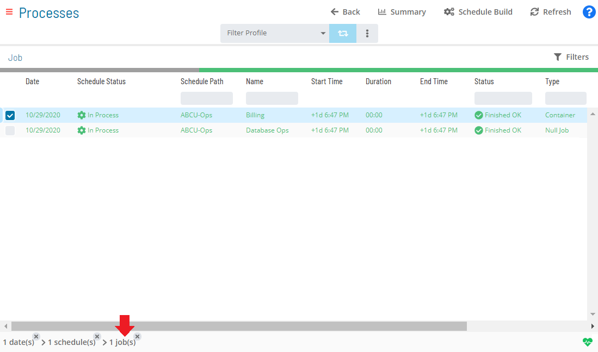

# Viewing Container Job Details

Like Null jobs, you will only be able to view the Container job details
in **Daily Job Definition**. For more conceptual information, refer to
[Container Job Type](../../Concepts/Container-Job-Type.md){.MCXref
.xref} in the **Concepts** online help.

To view job details:

Click on the **Processes** button at the top-right of the **Operations
Summary** page. The **Processes** page will display.

Ensure that both the **Date** and **Schedule** toggle switches are
enabled so that you can make your date and schedule selection,
respectively. Each switch will appear green when enabled.

{.dropshadow}

Select the desired **date(s)** to display the associated schedule(s).

Select one or more **schedule(s)** in the list.

Select one **Container job** in the list. A record of your selection
will display in the [status bar](SM-UI-Layout.md#Status) at the
bottom of the page in the form of a breadcrumb trail.

{.dropshadow}

Click on the job record (e.g., 1 job(s)) in the status bar to display
the **Selection** panel.

  -------------------------------------------------------------------------------------------------------------------------------- ------------------------------------------------------------------------------------------------------------------------------------
  .png "Note icon")   **NOTE:** [As an alternative, you can right-click on the job selected in the list to display the **Selection** panel.]
  -------------------------------------------------------------------------------------------------------------------------------- ------------------------------------------------------------------------------------------------------------------------------------

.png "Job Summary Tab for Container Jobs"){.dropshadow}

Click the **Daily Job Definition** button 
at the top-left corner of the panel to access the **Daily Job
Definition** page. By default, this page will be in **Read-only** mode.

Expand the **Task Details** panel to expose its content. For Container
jobs, the following read-only details are displayed:

-   **Type**: The job type.
-   **Master Sub-Schedule**: The Master subschedule name.
-   **Sub-Schedule Name**: The Daily subschedule name.
-   **Sub-Schedule Path**: The Daily subschedule path.

  -------------------------------------------------------------------------------------------------------------------------------- ------------------------------------------------------------------------------------------------------------------------------------------------------------------
  .png "Note icon")   **NOTE:** [If privilege has not been granted to the schedule to run as a sub-schedule, then the Task Details read-only field values will be hidden.]
  -------------------------------------------------------------------------------------------------------------------------------- ------------------------------------------------------------------------------------------------------------------------------------------------------------------

:::

 

