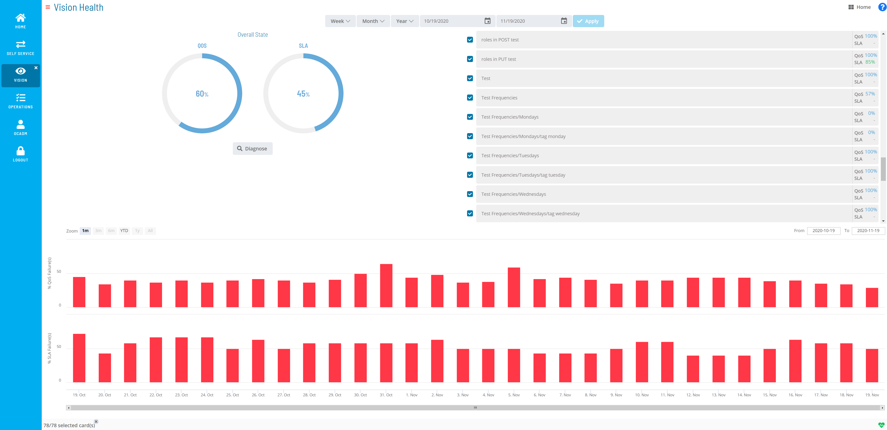
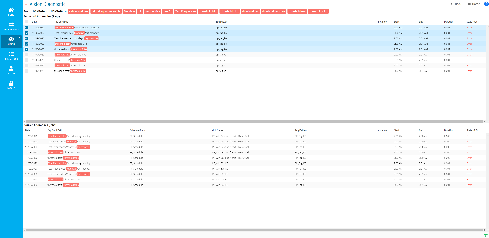

#  Viewing Vision Health

Vision Health allows you to view a dashboard of the historical data for
completed Vision cards. Additionally, the Vision Health page provides a
high-level view of the data represented from the Operations module. For
more information on the Operations module, refer to [Working with Operations](Working-with-Operations.md) in the
**Solution Manager** online help.

Vision Health Page

{.dropshadow}

 

The health summary includes a quantitative summary of the performance of
completed cards and their associated job data. There are two views of
data: the QoS (Quality of Service) and the SLA (Service Level
Agreement). These views display the summary rates of the QoS and SLA for
a selected Vision card during a selected period plus the associated
details.

 

An administrator user can set thresholds, a critical level and a
tolerable level, on cards for both QoS and SLA. For more information on
thresholds, refer to [Managing Vision Settings](Managing-Vision-Settings.md#Thresholds) in the **Solution
Manager** online help.

-   **Overall State/Partial State**: Displays a summary of the
    operational health based on selected cards (which are listed to the
    right) and their associated QoS and SLA over a selected period. By
    default, all cards are selected, which provides an overall health
    summary.
    -   **QoS**: Defines, as a percentage, a measure of the number of
        times jobs have completed successfully. By default, an average
        of the QoS for all cards is displayed.
    -   **SLA**: Defines, as a percentage, a measure of the number of
        times jobs have completed within the defined SLAs. By default,
        an average of the SLA for all cards is displayed.
    -   **Diagnose**: This button navigates to the [Vision         Diagnostic](#Vision) page, which provides
        additional details on anomalies.
-   **Week**: Allows you to filter the data by week.
    -   **Last**: Filters the data to display the last week, defined as
        the previous Monday through Sunday.
    -   **Sliding**: Filters the data to display the last seven days,
        including the current day.
-   **Month**: Allows you to filter the data by month.
    -   **Last**: Filters the data to display the last month, defined as
        the last named calendar month.
    -   **Sliding**: Filters the data to display the last calendar month
        (28-31 days), including the current day.
-   **Year**: Allows you to filter the data by year.
    -   **Last**: Filters the data to display the last full year prior
        to the current year.
    -   **Sliding**: Filters the data to display the last 365 or 366
        days, including the current day.
-   **Calendar**: Defines the date range. The dates can be manually
    selected using the calendar tool, manually entered in the date
    field, or automatically defined by selecting a Week, Month, or Year
    option.
-   **Apply**: This button applies manually-defined dates.
-   **Zoom**: This filter will zoom in the data to the following ranges:
    -   **1m** (1 month)
    -   **3m** (3 months)
    -   **6m** (6 months)
    -   **YTD** (Year to date)
    -   **1y** (1 year)
    -   **All**
-   **From**: Defines the starting date represented in the % QoS
    Failure(s) and % SLA Failure(s) frames.
-   **To**: Defines the ending date represented in the % QoS Failure(s)
    and % SLA Failure(s) frames.
-   **% QoS Failure(s)**: Defines the percentage of QoS failures for the
    date range specified.
-   **% SLA Failure(s)**: Defines the percentage of SLA failures for the
    date range specified.

## Vision Diagnostic

The Vision Diagnostic page allows you to find information on what caused
an anomaly. The diagnosis takes the context of the date range defined
from the Vision Health page combined with the cards selected in the
Detected Anomalies (Tags) section and searches for the root cause(s) of
the health issues (i.e., what caused a low QoS percentage or caused an
SLA to fail meeting its criteria).

Vision Diagnostic Page

{.dropshadow}

-   **From \[Date\] to \[Date\] on \[Tag\]**: Defines the date range     specified on the Vision Health page for the listed card pattern
    (tag).

-   **Detected Anomalies (Tags)**: This frame lists the tag-related data
    for detected anomalies.

    -   **Date**: Defines the date the anomaly was detected.
    -   **Tag Card Path**: Defines the card path.
    -   **Tag Pattern**: Defines the pattern (tag) defined for the card.
    -   **Instance**: Defines the remote instance (if any) defined for
        the card.
    -   **Start**: Defines the start time for the card.
    -   **End**: Defines the end time for the card.
    -   **Duration**: Defines the duration of time the card ran.
    -   **State (QoS)**: Defines the state of the card.

-   **Anomalies Source (Jobs)**: Defines the job-related details for the
    tag(s) selected in the Detected Anomalies (Tags) frame.

    -   **Date**: Defines the date the anomaly was detected.
    -   **Tag Card Path**: Defines the card path.
    -   **Schedule Path**: Defines the schedule path for the job(s)
        associated to the card.
    -   **Job Name**: Defines the job name associated to the card.
    -   **Tag Pattern**: Defines the pattern (tag) defined for the card.
    -   **Instance**: Defines the remote instance (if any) defined for
        the card.
    -   **Start**: Defines the start time for the job.
    -   **End**: Defines the end time for the job.
    -   **Duration**: Defines the duration of time the job ran.
    -   **State (QoS)**: Defines the state of the job.

## Vision Health Colors

Vision Health uses colors for the QoS and SLA charts and percentages
that dynamically change based on the threshold levels set for a card.
For more information on thresholds, refer to [Managing Vision Settings](Managing-Vision-Settings.md#Thresholds) in the **Solution
Manager** online help.

 

Vision Health uses the following color indications:

-   **Green**: The threshold level set for the card is good.
-   **Orange**: The threshold level set for the card is tolerable.
-   **Red**: The threshold level set for the card is critical.
-   **Blue**: The threshold level set for the card is unknown. There are
    no thresholds set or there are multiple values within the selected
    time period.

  -------------------------------------------------------------------------------------------------------------------------------- ----------------------------------------------------------------------------------------------------------------------------
  .png "Note icon")   **NOTE:** [The colored bullets are indicators that a card is selected and have nothing to do with thresholds.]
  -------------------------------------------------------------------------------------------------------------------------------- ----------------------------------------------------------------------------------------------------------------------------
:::

 

